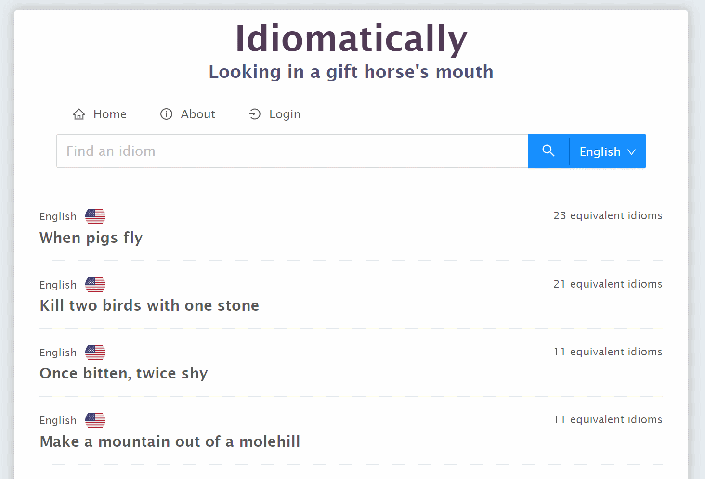
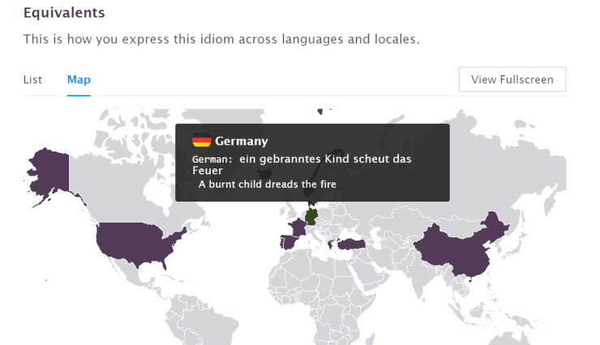
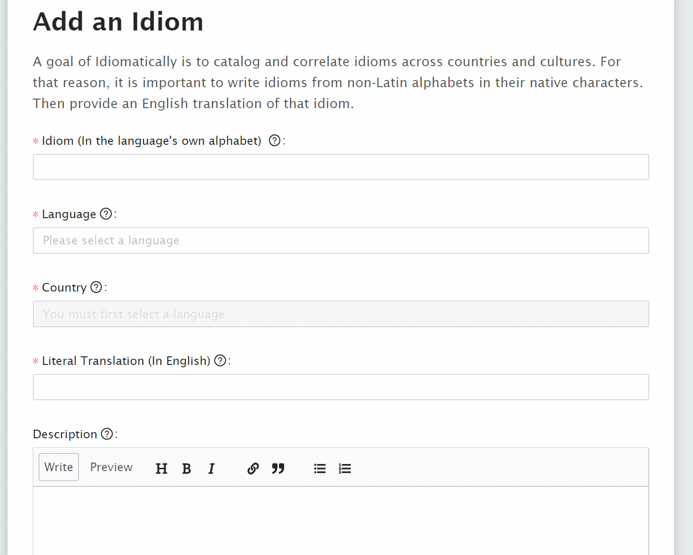

# Idiomatically

[](https://github.com/mmanela/idiomatically/actions?workflow=Node+CI) [](https://github.com/mmanela/idiomatically/actions/workflows/dockerimage.yml)
## About 
[Idiomatically](https://idiomatically.net/) is a site for exploring idioms across languages and locales. 

Check out this [blog post](https://medium.com/@mmanela/idiomatically-net-bc428a8d498f) to learn more about the inspiration for Idiomatically.net.

### Search for idioms and filter by language



### Explore different ways to express an idiom in other languages and locales



### Contribute or update idioms



## Technologies
Idiomatically started as a side project to explore different technologies. I hope it serves as an example of how to combine these together into a functioning application. Some of the technologies used are

- [TypeScript](https://www.typescriptlang.org/)
- [React](https://reactjs.org/)
- [React Router](https://reacttraining.com/react-router/)
- [Apollo](https://www.apollographql.com/) (server and client) with Server Side Rendering
- [GraphQL](https://graphql.org/)
- [MongoDB](https://www.mongodb.com/) (using the [Azure CosmosDB API for MongoDB](https://docs.microsoft.com/en-us/azure/cosmos-db/mongodb-introduction))
- [Node.js](https://nodejs.org/)
- [Express](http://expressjs.com/)
- [Passport.js](http://www.passportjs.org/) for authentication
- [Ant Design](https://ant.design/) (UX Framework)
- [Docker](https://www.docker.com/)
- [GitHub Actions](https://github.com/features/actions) (Used to build and publish docker image to Azure WebApps)

## Running Locally 

There are a couple options to run locally. To do iterative development you should run with node locally. But you can also quickly get an instance up with docker.


### Node 

For development you must first set configuration up a configuration file by creating a file `lib/.env.staging.local` that contains filled in settings from [this example file](https://github.com/mmanela/idiomatically/blob/master/lib/.env.example.local). 

Once configured you can run the server and client server to enable iterative development. 

__Server__

`yarn server:start`

__Client__

`yarn client:start`


### Docker

To get it running self-contained you can just use docker-compose which will bootstrap it with a local mongodb instance.

```
docker-compose up --build
```

To stop the service run:
```
docker-compose stop
```
