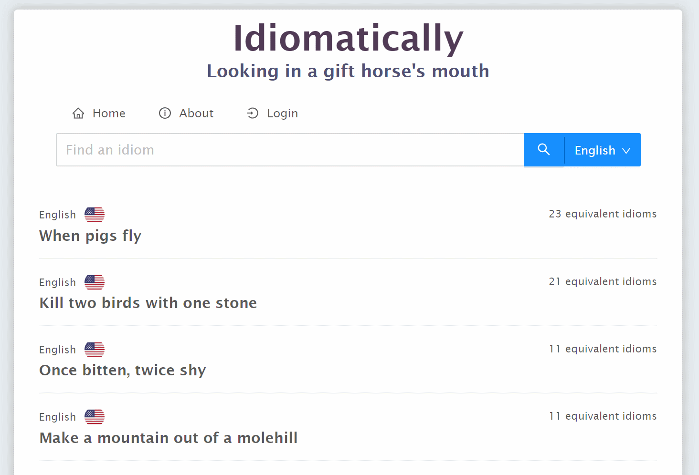
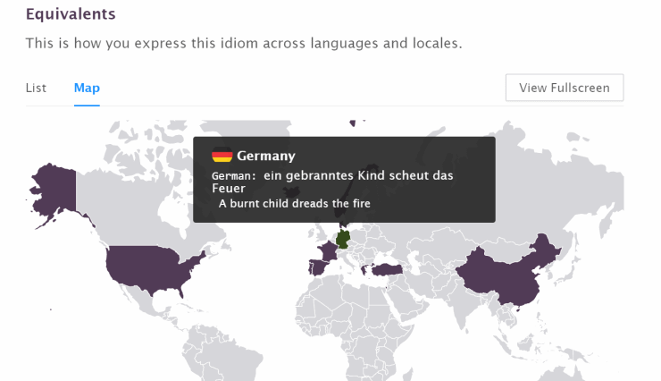
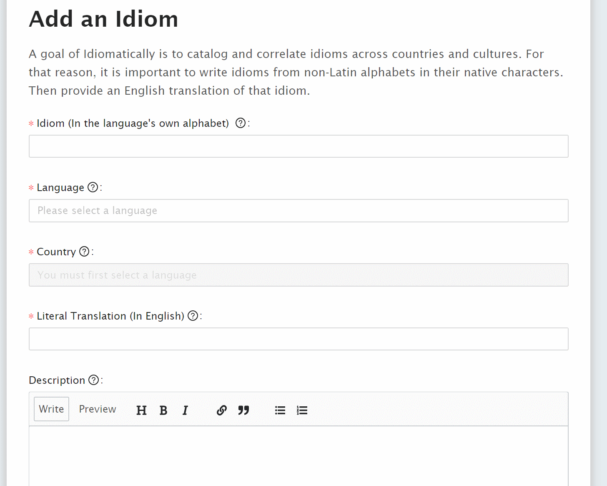

# Idiomatically

[](https://github.com/mmanela/idiomatically/actions?workflow=Node+CI) [](https://github.com/mmanela/idiomatically/actions/workflows/dockerimage.yml)
## About 
[Idiomatically](https://idiomatically.net/) is a site for exploring idioms across languages and locales. 

Check out this [blog post](https://medium.com/@mmanela/idiomatically-net-bc428a8d498f) to learn more about the inspiration for Idiomatically.net.

### Search for idioms and filter by language



### Explore different ways to express an idiom in other languages and locales



### Contribute or update idioms



## Technologies
Idiomatically started as a side project to explore different technologies. I hope it serves as an example of how to combine these together into a functioning application. Some of the technologies used are

- [TypeScript](https://www.typescriptlang.org/)
- [React](https://reactjs.org/)
- [React Router](https://reacttraining.com/react-router/)
- [Apollo](https://www.apollographql.com/) (server and client) with Server Side Rendering
- [GraphQL](https://graphql.org/)
- [MongoDB](https://www.mongodb.com/) (using the [Azure CosmosDB API for MongoDB](https://docs.microsoft.com/en-us/azure/cosmos-db/mongodb-introduction))
- [Node.js](https://nodejs.org/)
- [Express](http://expressjs.com/)
- [Passport.js](http://www.passportjs.org/) for authentication
- [Ant Design](https://ant.design/) (UX Framework)
- [Docker](https://www.docker.com/)
- [GitHub Actions](https://github.com/features/actions) (Used to build and publish docker image to Azure WebApps)

## Running locally

Local development uses Node.js 22, npm, and Docker for MongoDB. Start Docker Desktop before running the app.

### Quick start

```sh
cd lib
npm install
npm run dev
```

Open http://localhost:3000. The `dev` command starts MongoDB with Docker Compose, then runs the API on port 8000 and the React client on port 3000 with live reload.

The committed development configuration is enough to browse and edit local data. Google sign-in is disabled by default. To test authentication or optional integrations, copy `lib/.env.example.local` to `lib/.env.development.local` and add the relevant credentials.

Useful commands:

```sh
npm run dev       # MongoDB + API + client
npm run db:stop   # stop the local MongoDB container
npm run check     # regenerate GraphQL types and create a production build
```

If you use nvm, run `nvm use` from `lib/`. The repository also includes an asdf Node version in `lib/.tool-versions`.

### Containerized app

```sh
docker compose --profile app up --build
```

The containerized app is available at http://localhost:8000. Stop it with:

```sh
docker compose --profile app down
```
